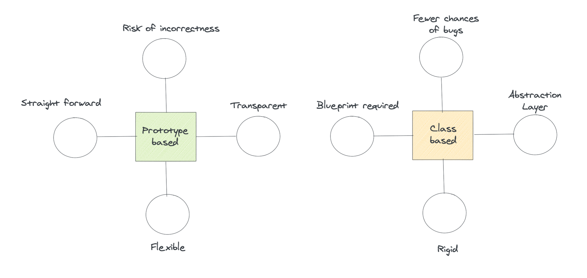

# Introduction

## Definition

**Object-oriented programming** is a style of programming, it’s very popular and widely used by breaking a program into segments of **objects** that can communicate with each other. Each object is defined by its own set of **properties**. These properties can then be accessed and modified through various operations.

Example:

The above illustration represent example of employee record. Each employee can be considered as an **Object**. Every employee has name, age and position, these can be considered as **Properties** of that employee.

## OOP in Javascript vs Other languages

If you have the background from the obther languages such as C++, Java or C#, you must have seen keyword `class` to defined a class. A class has properties and methods in it for every instance of that class. `class` in this case acts like a blue print for the object.

However in Javascript, we can implement OOP without using classes (Before or even after ES2015). Javascript relied on **Prototype-based programming.** The object encapsulates the properties such as its method and data, instead of a class. We can new properties to object or if we want an object, we can easily create one without having to create a class first.

| Prototype-based                          | Class-based           |
| ---------------------------------------- | --------------------- |
| No need to create a blueprint beforehand | Blueprint required    |
| Flexible (can create object directly)    | Rigid                 |
| Risk to get more bugs                    | Fewer chances of bugs |

## ES6 vs ES5

Here is ES6 features that can help us write cleaner code in OOP style.

### `class` keyword

ES5 used `function` directly to create an object, but in ES6 version is just cleans up the syntax by using `class` to define a class

### getter/setter syntax

The object properties use `get/set` to access/modify their values. ES6 version provides an improved, easy to use, and clear syntax for Get and Set methods.

### constructor function syntax

Constructor functions are declared using the `function` keyword in ES5 version, initializing the object properties upon its creation. The ES6 version, uses the `constructor` keyword to declare the constructor function which runs on object creation. This new syntax is clearer and easier to use.

### `extends` keyword

The ES6 version uses keyword `extends` for setting up the inheritance relationship between parent and child.

### `super` keyword

`super` is used to call the constructor on parent object that inherited by the child.

### `static` keyword

Static members declaration has been introducing with the keyword `static` in ES6 syntax

## Recap

- Object-oriented programming is a style of programming used to break a program into segments of objects that can communicate with each other.
- OOP in Javascript is different from OOP in C++ Java and C#
- OOP in JavaScript follows prototype-based programming.
- Prototype-based programming invloves making an object directly without making a class for it.
- Prototyped-based programming is more flexible and transparent than Class-based programming.
