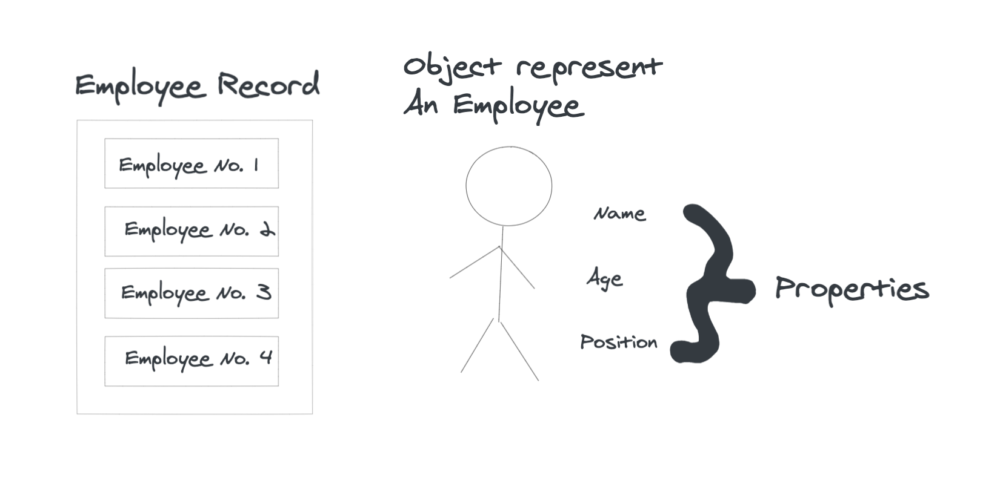

# Definition

Object-oriented programming is a style of programming, it’s very popular and widely used by breaking a program into segments of objects that can communicate with each other. Each object is defined by its own set of properties. These properties can then be accessed and modified through various operations.

Example:

The above illustration represent example of employee record. Each employee can be considered as an Object. Every employee has name, age and position, these can be considered as Properties of that employee.
