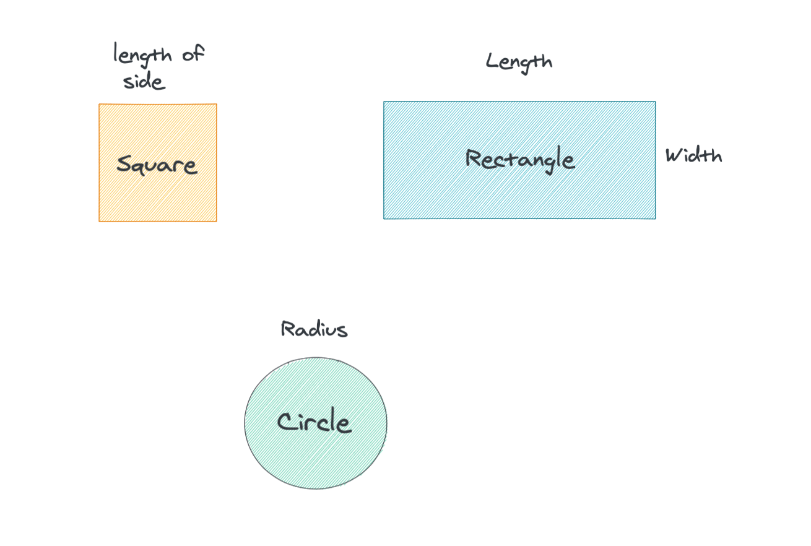

# Object in Javascript

Almost everything in Javascript is an object. For example, functions, arrays, regular expressions, dates, and even data types like boolean and strings, if declared with the keyword new, can be considered an object.

## Example

Let's say you have 3 shapes: square, rectangle and circle and you want to calculate the areas of all 3 shapes. What would you begin? The common approach would be to write `functions` to compute the areas. Another approach would be using Object-Oriented paradigm by creating `objects` for each shape, each object has its own set of properties like this:

- data values
- functions



Length, width and radius as data values and we require a function to calculate the area as a part of its properties.

## Creating Object Literal

An object literal can be created:

- using {...}
- using `new` keyword
- based on existing object by using `create()` method

```javascript
// using {}
const myObject = {  
  // defined properties separated by a comma.
  propertyName1 : propertyValue1,
  propertyName2 : propertyValue2,
  functionName() {}
}

// new keyword
const myObject2 = new Object() // we'll get empty Object

// Object.create()
const myObject3 = Object.create(existingObject)
```

Another example with employee object

```javascript
const employee = {
  name: 'Teerapat',
  age: 35,
  position: 'Software Developer',

  displayName() {
    console.log('My name is Teerapat')
  }
}

employee.displayName()
console.log('Age is:', employee.age)
console.log('My role is:', employee.position)
/* 
Name is Teerapat
Age is: 35
Designation is: Software Developer
*/
```
