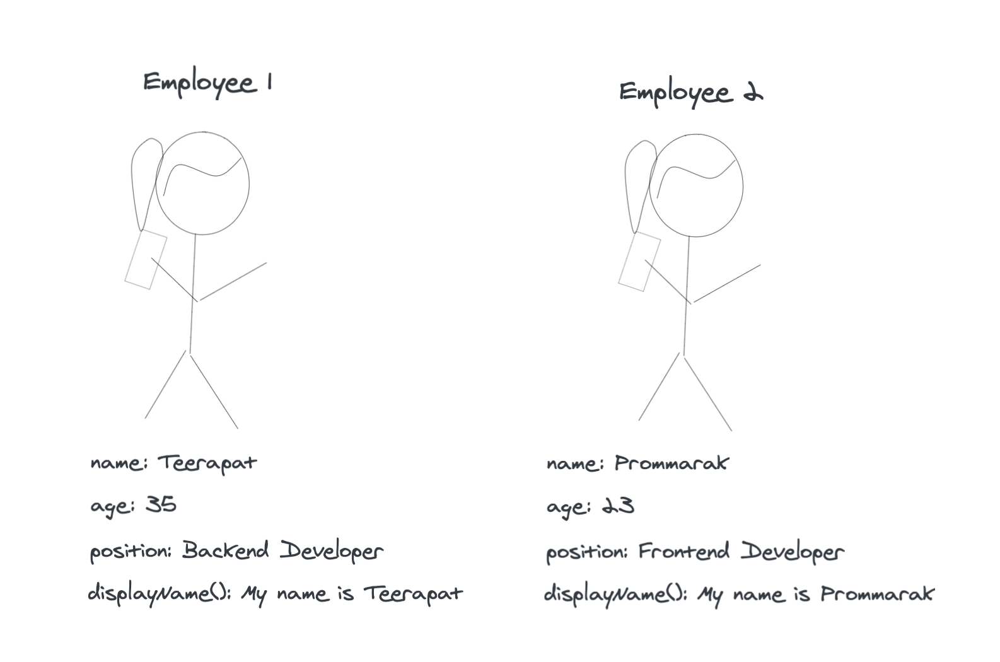
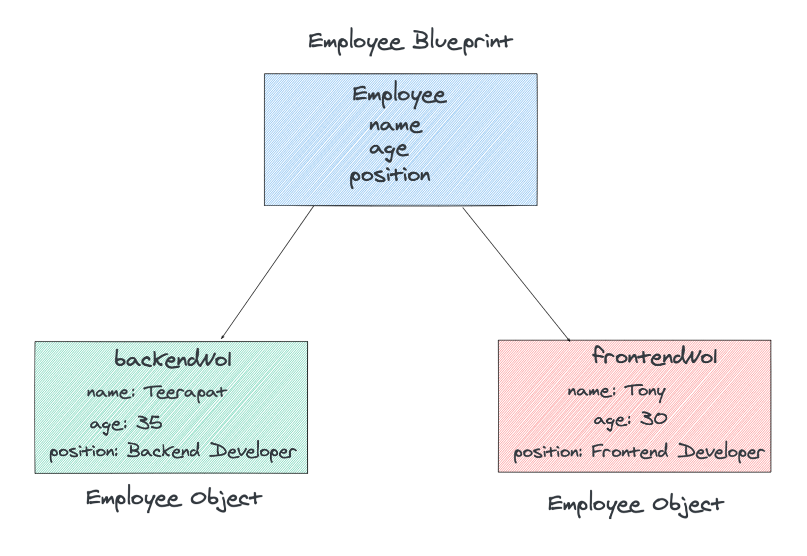

# Functions as Objects

In Javascript, functions also objects because they also have their own properties and methods. Functions also can be used to construct objects as we know as **Constructor Functions**. Let' say we want to create more `employee` with properties as picture below:



Based on we've learned so far, we need to copy-paste new object and change values of every properties. What if there are 100 or 1000 employees in the company? The answer is we need to find a new approach that is clean and concise. Let's see how.

## Constructor Functions

Instead of copy-paste from existing object, it would be great if we can have a template or blueprint with all properties for the object `employee`. The way to create an object type from a blueprint is by using **constructor functions**.

```javascript
function Employee(name, age, position){
  this.name = name;
  this.age = age;
  this.position = position;
}
```

Explanation

- keyword `function` is used to define the function
- Constructor Function name should be capitalized (Employee)
- For the body of `Employee` is a constructor part to initializes the properties by setting to equal `name`, `age` and `position` that being passed into `Employee` function. Whenever a new object is created, this is used to refer to this new object and set its property values.

## Creating an Object Instance

```javascript
function Employee(name, age, position){
  this.name = name;
  this.age = age;
  this.position = position;
}

const backendNo1 = new Employee('Teerapat', 35, 'Backend Developer');
const frontendNo1 = new Employee('Tony', 30, 'Frontend Developer');
```



Explanation

- using `new` keyword
- constructor function `Employee` being called, then returned the object and store in variables `backendNo1` and `frontendNo1`.
- Each new object created will store the argument values passed into the constructor function (`name, age, position`)
- constructor function executes every time a new object is instantiated.
